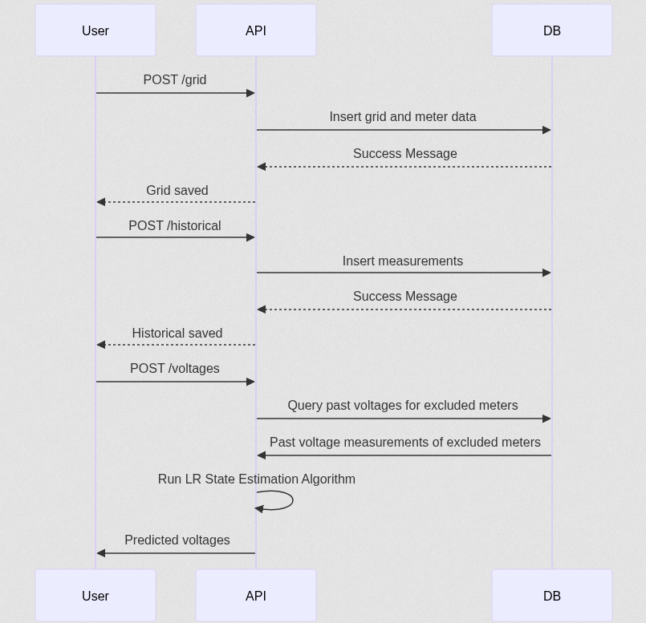

# ⚡ GridSights

**GridSights** is a modular and extensible API for managing grid topology, ingesting historical measurement data, and performing distributed state estimation to predict voltages of unknown or excluded meters based on known data and historical patterns.

Built with **FastAPI**, **SQLite**, and **NumPy**, the system supports:

- Grid and meter configuration via API
- Historical data insertion
- Linear Regression-based voltage prediction
- Modular service structure and Pydantic validation

---

## Features

- ✅ Store and manage grid metadata (`/grid`)
- ✅ Insert historical measurements for voltage, power, and exogenous variables (`/historical`)
- ✅ Predict voltages of excluded meters based on:
  - Lagged historical values
  - Known meters at current timestep (`/voltages`)
- ✅ Modular structure with clean separation of routers, services, schemas, and database layers
- ✅ Environment-driven configuration (e.g., `GRID_DB_NAME`)

---

## 📁 Project Structure

```
ddse/
│
├── app.py                    # FastAPI app entry point
├── database/
│   ├── __init__.py
│   ├── grid_database.py        # DB init for grids and meters
│   ├── measurements_database.py
│   └── state_estimation_db_helper.py
│
├── schemas/
│   ├── grid.py                # Grid & Meter schemas
│   ├── historical.py          # Historical measurement schemas
│   └── state_estimation.py    # State estimation + prediction schemas
│
├── algorithm/
│   └── beta_computation.py    # Linear Regression algorithm
│
└── routers/
    ├── grid.py
    ├── historical.py
    └── state_estimation.py
```

---

## How to Run

```bash
# Install dependencies
pip install -r requirements.txt

# (Optional) Set custom DB file
export GRID_DB_NAME=my_database.db

# Start the FastAPI server
uvicorn ddse.app:app --reload
```

Access the interactive API docs at:  
[http://localhost:8000/docs](http://localhost:8000/docs)

---

## Endpoints

| Endpoint         | Method | Description                          |
|------------------|--------|--------------------------------------|
| `/grid`          | POST   | Store or update grid and meters      |
| `/historical`    | POST   | Insert historical voltage data       |
| `/voltages`      | POST   | Predict voltages for excluded meters |
|                  |        |for a single timestep                 |

---

## Prediction Logic

- Each **excluded meter** is predicted using:
  - its own lagged voltage values (`t-1`, `t-2`, `t-7 days`)
  - the current voltages of the **included meters**
- The coefficients (**β**) are computed via **least squares regression**
- The final predicted voltage is calculated using the function `v_pred`
in beta_computation.py file.

---
## Workflow Diagram



## Example Workflow

1. **Configure the grid** via `/grid`
2. **Upload measurements** via `/historical`
3. **Send current estimation data** via `/voltages`:
   - Includes known meter readings
   - Predicts voltages for unknowns

---

## Tech Stack

- Python 3.10+
- FastAPI
- NumPy
- SQLite
- Pydantic

---

## ⚙️ Environment Variables

| Variable         | Description                       | Default          |
|------------------|-----------------------------------|------------------|
| `GRID_DB_NAME`   | SQLite DB file path               | `grid_data.db`   |

---

## Contact

For questions, feedback or contributions, feel free to open an issue or contact:

- [David Lima](mailto:david.lima@inesctec.pt)

